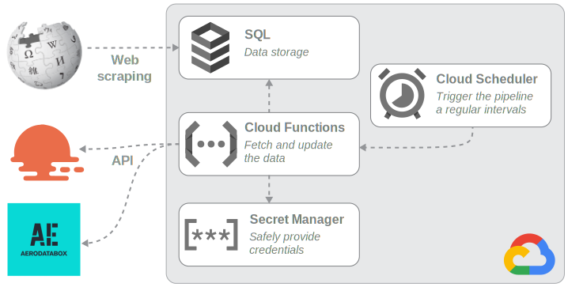

# Gans Data Engineering

[](https://medium.com/p/e9d8618641ab)
[](https://szapp.github.io/GansDataEngineering/)

Data engineering project with web scraping and API calls using MySQL, Pandas, and Google Cloud.

## Project

*Gans* is a fictional company providing electric scooters for rent.
To distribute their scooters for customers efficiently, they need data about the cities of operation, such as population, weather forecast and flight arrival times from nearby airports.

The goal of this project is to establish a data engineering pipeline in the cloud (Google Cloud Platform).
Information is collected using web scraping and API calls and continuously updated via cloud scheduling.
A set of tables in a relational cloud SQL instance serve the data to be always accessible and up-to-date data.

<div align="center">
  <picture>
    
  </picture>
</div>

## Resources

To accomplish these tasks, I have compiled the following resources for this project.

1. A Python package for implementing the pipeline in this [repository](https://github.com/szapp/GansDataEngineering)

2. A technical [documentation](https://szapp.github.io/GansDataEngineering/) describing the Python package and its setup locally and in the cloud

3. An article on &nbsp;[](https://medium.com/p/e9d8618641ab)&nbsp; about establishing a Data Engineering project on the Google Cloud Platform

<div align="center">
  <a href="https://medium.com/p/e9d8618641ab">
    
  </a>
</div>

## Objectives

1. Setup local MySQL database  
   *Tools: MySQL Workbench, Python, SQLAlchemy, mysql-connector-python*
   
1. Collect static data of cities and airports using web scraping  
   *Tools: Python, Pandas, BeautifulSoup*
   
1. Collect dynamic data of weather and flights using web API calls  
   *Tools: Python, Pandas, Requests*
   
1. Implement a pipeline locally  
   *Tools: Python, functions-framework*
   
1. Deploy the pipeline on Google Cloud Platform  
   *Tools (Google Cloud Services): Cloud Functions, SQL, Cloud scheduler, Secret Manager*
   
1. Document the findings by writing an article  
   *Tools: Medium.com*
   
1. Write a technical documentation of the implementation  
   *Tools: MkDocs*

## Languages, Libraries, and Tools used

- MySQL Workbench
- Pandas
- BeautifulSoup
- Requests
- RapidAPI
- Google Cloud Services
- MkDocs
- GitHub Pages
- Medium.com

## Repository Structure

```
├── pipeline                <- Source code of the Python package
│   │
│   ├── database.py         <- Database class as user interface for all operations
│   │
│   ├── create_database.sql <- SQL script for creating the database structure
│   │
│   ├── cities.py           <- Internal functions for collecting static data using web scraping
│   ├── airports.py
│   │
│   ├── weather.py          <- Internal functions for collecting dynamic data using APIs
│   └── flights.py
│   
├── docs                    <- MkDocs documentation of the Python package 'pipeline'
│
├── requirements.txt        <- Dependencies for reproducing the pipeline environment
│
├── example.env             <- Environment variables for sensitive data
│
└── main.py                 <- Google Cloud Functions script
```
